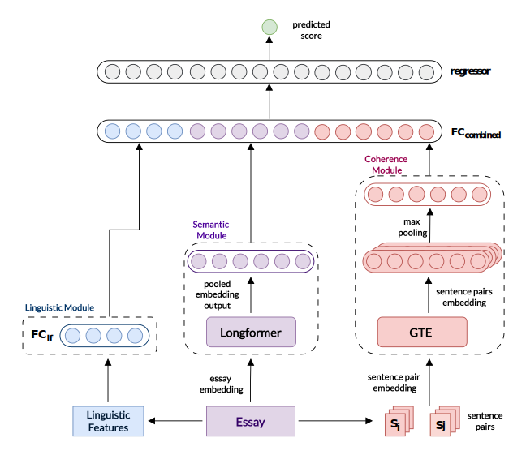

# Leveraging Deep Neural Networks and Feature Fusion in Automated Essay Assessment

## Description

This the code repository for the Kaggle competition [Automated Essay Scoring 2.0](https://www.kaggle.com/competitions/learning-agency-lab-automated-essay-scoring-2) hosted by The Learning Agency Lab.

In this project, we developed an AES system from scratch using a hybrid framework that combines deep neural networks with feature fusion techniques. Our model, LSC, integrates linguistic, semantic, and coherence features to evaluate essays accurately on a scale of 1 to 6. After adding the coherence module, our model achieved a quadratic weighted kappa score improvement of 0.068 compared to the linguistic and semantic model.



*Illustration of LSC model’s architecture with the Linguistic, Semantic, and Coherence module.*


## Directory Structure
```
├── automated-essay-scoring
│   ├── aes-lsc.ipynb
|   ├── aes-lsc-infer.ipynb
│   ├── analysis-preprocess
│   │   ├── data-analysis.ipynb
│   │   ├── get-linguistic-features.ipynb
│   ├── Group6_Final_Project_2324II_INT3414_21.pdf
│   ├── modules
│   │   ├── data.py
│   │   ├── evaluate.py
│   │   ├── linguistic_features.py
│   │   ├── model.py
│   │   ├── training.py
```

- `aes-lsc.ipynb`: Main notebook for the LSC model training and evaluation.
- `aes-lsc-infer.ipynb`: Notebook for model inference and competition submission.
- `analysis-preprocess`: Directory containing notebooks for data analysis and preprocessing.
- `Group6_Final_Project_2324II_INT3414_21.pdf`: Final project report.
- `modules`: Directory containing Python scripts for data processing and loading, feature extraction, model architecture, model training, and evaluation.